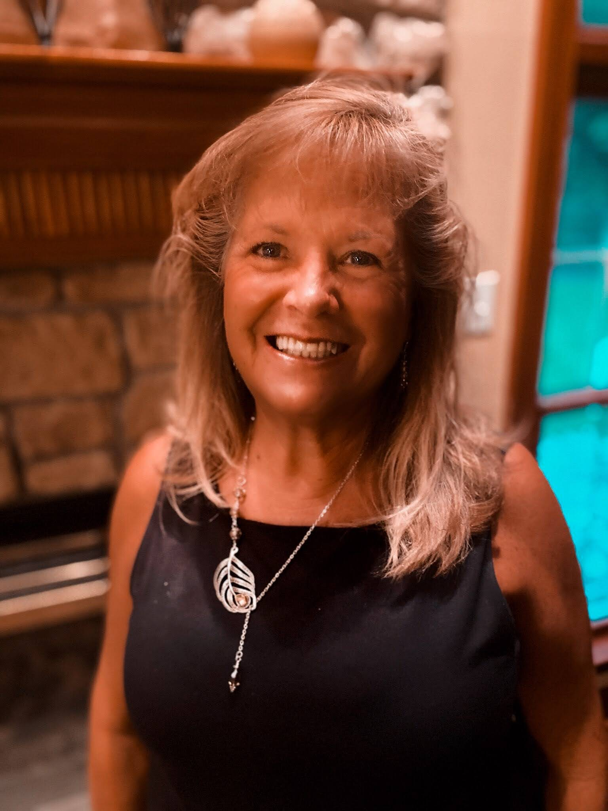

I recently lost my beloved Mom to a 10-month battle with deadly [Pancreatic Cancer](https://www.mayoclinic.org/diseases-conditions/pancreatic-cancer/symptoms-causes/syc-20355421) on **June 6th, 2025**. This README will detail the journey from the cancer diagnosis until she passed. I will also create separate journals on what days were like after her death and how I'm processing it. This repository is a big work-in-progress since everything is completely raw/devastating to me right now and there are some days I may skip and come back to.

I understand this may be a bit weird and unusual to some, especially storing all of this information inside a *public* GitHub repository (not sure if this has really been done on GitHub before). I tend to create GitHub repositories for things other than just source code and documentation. It's still just as useful for these type of things in my opinion and love having everything in one place.

My goal is to not only help myself, but help others who have lost or are in the middle of losing a loved one along with those currently experiencing stages of grief. I also just wanted to share my story and I've found writing about everything I've experienced in this tragedy has helped so far.

This has been the worst pain I've had to endure in my lifetime by a **LONG** shot and just writing about it makes me feel a little better and it also gives me some closure as well. If this writing helps others, that'll make me feel even better.

If you're suffering and want somebody to talk and/or relate to, my DMs are open! If you have Discord, you can add me! My username is `gamemann`, but I'd recommend joining my [Deaconn](https://discord.deaconn.net/) Discord server first since I get a lot of spam friend requests that are ignored most of the time. You can also email me or contact me through my social media profiles!

I also want this repository to act as a tribute to my awesome Mom. I've added pictures I love and adore inside of the [`pictures/`](./pictures/) directory. There are also memories and stories available in the [`memories/`](./memories/) directory. Both of these directories will be updated over time as I progress through these difficult times.

Once I learn how to cope with this painful loss properly, I also plan on making an open-source website dedicated to my Mom that'll share her pictures, stories, and more. I plan on hosting it on my cheap VPS inside of a Docker container like my other websites I've made.

**DISCLAIMERS** - Some things said in this repository may potentially trigger PTSD or trauma, especially since I go into detail on what my Mom went through. I'm also very very emotional and exhausted, and some things I say, especially at the end, are very deep and personal. Lastly, the main story here (the README) is not finished and there may be grammar mistakes and improvements that can be made. I plan on improving the flow, layout, and grammar mistakes in the future.

## My Mom

My Mom was born on **August 30th, 1958** and passed on **June 6th, 2025**. She was only **66 years old** when she passed (which is considered somewhat young in my opinion). She was the sweetest woman I've ever known and my best, **best** friend. Her smile lit up every room regardless of the situation. She, in **every and any situation** (good or bad), would put others before her. That was the type of Mom and person she was.

She has touched so many people's lives in such a positive way throughout the years. She was religious (a Christian) and taught Sunday school for over 40 years (she respected everybody and all religions though, was never judgemental). She also did so much volunteer work around the community and town I grew up in including my elementary schools. While I was in elementary school, she was the PTA president for years and also a chaperone for the classes I was in. All of the kids in my classes loved her!

I also want to note my Mom was one of the healthiest people I knew. She never smoked, drank alcohol, or did any other sort of drugs. She was very active, played tennis, ran/jogged, and ate very healthy (vegetables, salad, etc.). My grandmother (her Mom) lasted until she was 96. This is what makes her cancer diagnosis and death so much harder, I was expecting her to live a very long life. Her side of the family also had no history of cancer. I've always been far more worried about my Dad since he has very high blood pressure (while on medication for it) and hasn't ate healthy his entire life.

## My Mom And I

I'm 27 years old and was born on December 10th, 1997. My Mom and I were very close, especially in the last two and a half years before she passed. Of course, we've had our issues just like any child and parent, but these issues mostly occurred during my teen and early adulthood years. After I lived in San Antonio, Texas for 4 - 5 years due to a job (long ways from home from New Jersey) and I moved back to my childhood home 2 and a half years ago, we were incredibly close. We'd watch movies and shows from my Plex server almost every single night and went on road trips, etc. She would also give great advice on my tech projects such as [TekWorks](https://tekworks.net) (formerly Deaconn) and my [TMC project](https://moddingcommunity.com). She also advised me on how to handle contract work for firewalls I'd create for companies which really helped me!

She was an **AMAZING** Mom...

## The Cancer Diagnosis
My Mom was diagnosed with Pancreatic Cancer in August, 2024. It was almost a miracle with how it was discovered. She was playing tennis one morning and her arm swelled up. She ended up going to the hospital where they found a blood clot and this is where they also discovered the tumor on her pancreas. Doctors said the tumor was so small that it wouldn't have caused the blood clot. So we thought it was caused by a dog bite she got a couple of months prior that ended up getting infected. My Mom rarely ever went to the doctors or took medication, so it was crazy that those events led to her going to the hospital and getting the tumor discovered. We weren't sure whether the tumor was cancerous at the start, but after one - two weeks of testing and a biopsy, it was confirmed cancerous.

The tumor was found very early according to the doctors which was a big relief at the time because pancreatic cancer typically doesn't come with symptoms until you're in very later stages which is one reason why it's so brutal.

Due to these circumstances, we were very hopeful and optimistic that she was going to beat it.

## Treatment
A complicated part of her specific tumor was that it was located in a very complex area right next to a critical vein to my understanding. This meant they couldn't go right in and remove it through surgery. Instead, the initial plan was to perform a few rounds of chemo to shrink the tumor and then perform a [Whipple Procedure](https://www.mayoclinic.org/tests-procedures/whipple-procedure/about/pac-20385054).

Unfortunately, between the time of the biopsy and starting the first round of chemo (around a month), scans showed that the cancer spread a *little* bit to the stomach lining (it was rarely noticeable on the scans they said). Although it wasn't really noticeable, this called off any possibilities of whipple surgery which really sucked. However, we were still very optimistic with chemo.

## First Set Of Chemo
I don't have the direct dates or know the exact chemos used (my friends were the ones that went up with her to the hospital to get it since they were also doctors/nurses and knew much more than me in those fields). She started chemo in September of 2024 and this lasted until early January of 2025. During this time, chemo was working very well. After chemo treatment, my Mom would feel really tired for a few days, but she didn't really have much pain. She'd be right back to her normal self afterwards and she even played tennis.

I wasn't sure what to expect from chemo since I haven't really had anybody super close go through it before. I expected things like hair loss and such, but my Mom didn't lose that much hair with the first set of chemo.

In the end of this round, the tumor shrunk! This was awesome news and we were also told it was keeping the stomach tumors at bay as well.

## Second Set Of Chemo
The second set of chemo was considered "maintenance" chemo from what I was told. It wasn't as strong as the first set, but it should keep the tumors at bay.

January and Februrary were okay and honestly, it was during this time that life felt like it was finally returning back to *normal* before the diagnosis. We were all so hopeful she was going to beat it and she was in pretty good shape. We knew the tumor shrunk from before and from what we were told, the tumors on the stomach lining were still barely noticeable still. Her cancer markers were in the normal range!

My Mom planned back-to-back trips from Florida to California where she had a ton of fun with her friends. Things were great until the night she got back.

## The Start Of The Downfall
When my Mom returned from her trips in early March, she started throwing up. At the time, we were thinking it was potentially a stomach virus or maybe an ulcer in her stomach. Doctors were suspecting this as well. From this point on, she tried many different kinds of medication and other things to improve her condition. However, nothing really helped, sadly.

Unfortunately, from this point on, each day was either one step forward or one - two steps backwards. She would have days where she's feeling great and we're thinking she's going to start getting better day by day, but then the next day is 1 - 2 times worse than the day before. It was honestly gut-wrenching to watch. She was throwing up, having severe constipation, experiencing bathroom attacks, going through a lot of pain and discomfort in general. Medication continued to disappoint. However, **SHE STILL KEPT FIGHTING**!

During this time, fluid from the tumors on the stomach kept flooding her stomach. This caused her to throw up more and more along with not being able to eat. This resulted in her getting weaker day by day. While she always had this fluid building up ever since it spread to the stomach, the chemo up to this point kept it at bay. However, the fluid was building up quicker and quicker. This resulted in her needing to get it drained at the hospital weekly. After she'd get it drained, she felt better and could eat again. However, weekly drainages eventually became less effective since it'd build up in only 3 - 4 days resulting in her getting weaker overall and not being able to make a full recovery after getting the fluid drained.

This led to her sleeping pretty much all day and barely being able to walk.

The hospital decided to act quickly and give her a much more aggresive chemo. They were going to give her this chemo in four rounds (once every two weeks).

The first round went okay, but it definitely knocked her out much more than chemos performed at the beginning of our journey. However, this was to be expected. She still didn't seem to be getting much better after a week or two, but we were told that was going to be expected and it's going to take time and multiple rounds to see changes. This is also when her bathroom attacks started occuring and this resulted in her becoming extremely dehydrated (and more weaker). Unfortunately, the doctors never gave us at-home IVs and even though we were trying to give her water and liquid IV for hydration, she couldn't drink too much without throwing up and feeling really sick.

When she went in for the second round, this is when doctors were very concerned because she was so weak and they believed the second round of chemo would be too much. Even with this said, my Mom wanted to receive the second round because she really wanted to beat this awful cancer and show us that miracles exist. The only other option was giving up and waiting for her to die.

Unfortunately, the second round completely wrecked her. She lost all of her hair within a single day and she was bedridden the rest of the time. She was sleeping most of the time, but also always felt really sick regardless of her taking medication.

When she went to get her third round, she was far too weak and her blood pressure was critically low. This is where the doctors started suggestion either hospice or palliative care. My Mom didn't want hospice care because she always associated that with end of life and she didn't want to die. She wanted to keep fighting until the end and she **really** believed she was going to beat it.

## Palliative Care
After my Mom and her friends got back from the hospital, we decided it would be best to move my Mom to my Aunt's house since my Aunt is a better caretaker since she has a lot of experience with it. There were some other reasons for this as well, but I'll leave that out of here.

My Mom stayed at my aunt's house for around a week and a half. She had nurses and physical therapist that came. She mostly slept, but had moments where she could slightly talk and even had moments where she got up with a walker and walked to the kitchen to try to build up her strength.

Here's a couple of pictures of her and I watching the movie The Matrix! She LOVED this movie and it's one of my favorites as well!

She was still having her good and bad days (more bad than good, but that was to be expected with how fast the fluid was building). No major progress unfortunately, but there was still some hope towards the end because we switched cancer doctors to a doctor that knew my brother and Mom personally. She suggested that we should get a drain put into her stomach to drain the fluid so that we can do it at my Aunt's house every 3 days or so instead of needing to wait a week or longer to do it at the hospital.

## The End
When my Dad and I went to visit her at my Aunt's house on Saturday (May 31st, 2025), my Dad was really worried about her because she wasn't really able to talk and she was in and out of consious. He wanted to bring her to the hospital. Personally, I felt like she was in and out of consious for a while before this (weeks), so I wasn't sure why my Dad was so worried. However, since the procedure to put a drain in her stomach was only a few days away, I did believe it'd be best if she stayed at the hospital so she could get better care which would likely result in getting her stronger before the operation.

We drove her to the hospital and when she had her blood pressure taken, it was very low (70/65). This was very concerning, but when she got into a room, it went back up to around 80 - 90 over 70.

On Sunday, she was still able to talk slightly, but this was when she said her last words. She told my Dad that she wanted to go for a walk. This absolutely broke my heart because she still believed at this point she could beat it and this is what has made me so **SAD** and **ANGRY** given the conclusion. She didn't deserve ANY of the pain she went through, NONE OF IT. I was able to cope with her going through all of the pain throughout the last months because her and I **REALLY** believed she was going to beat the horrible cancer and afterwards the family would be a million times stronger and happier. Those were her last words to us, that **she wanted to go for a walk**...

Over the next couple of days, there was still a little bit of hope for the procedure. The original plan was to get her a little stronger and hit her with some light chemo. However, after the doctors saw her, they said even a light dose of chemo would most likely kill her.

This is unfortunately when they pulled us aside and told us she wasn't going to make it. They suggested hospice care. Around this time, she also started vomiting blood and this was a major sign of her organs shutting down.

We eventually made the very difficult choice of putting her on hospice care. This allowed more than two visitors at a time at the hospital she was staying at which was good in our situation as well since a lot of people wanted to see her at the time.

The same night, our cancer doctor (and friend) showed us the scans they performed a couple of days prior. She told us the small tumors in the stomach were rapidly mutating and this was the reason the fluid kept building up more quickly by day. They were draining the fluid nearly every day along with giving her [Ativan](https://www.drugs.com/ativan.html) to help with pain, anxiety, etc.

The next three - four days after that, she was sleeping. It wasn't until Monday (6/2/25) that I realized she's not going to make it. I remember my Dad telling me that my older brother and his wife was at the house to take me to the hospital. I was playing a game with a friend at this time, so I asked if it can wait until a little later (I wanted to go still, just not at that exact moment), but he told I should go right then and I did. It wasn't until I was in the parking lot of the hospital where I met my younger brother that I really realized what was happening. I told my younger brother our Dad said she was getting better. He said she wasn't and she likely doesn't have much time. From here, I started getting really sick, started shaking, started feeling light-headed, couldn't talk, and I started feeling like I was in a dream (like depersonalization). Reality was kicking in that there wasn't much hope and that I'm actually going to be losing my Mom, my best friend in the whole world.

She was on the top floor of the hospital (5th) and I'll never forget the sound of the heart monitor while entering her room (a high-pitched *beep* and lower-pitched *boop*, playing over and over again). When I got in there, a nurse was looking for a movie to put on for my Mom (my Mom was sleeping, but my Mom might of been able to hear it). She ended up putting on a movie, but she didn't know my Mom would like it or not. I looked up at the TV and recognized what was on. It was a movie called *Pride and Prejudice* (released in 2005). Personally, I've never watched the movie before, but my Mom very specifically told me months ago that it was her **favorite** movie when she was watching it. Everything was hitting me at once and I was almost speechless while holding my Mom's hand. My older brother was saying things, just telling her we're here, etc. I also said a few things, but I was mostly speechless and completely shattered.

Leaving the hospital and going home that night was brutal. I remember just not being able to say anything to any of my family members. I went into the backyard and kept seeing visions of her in our pool swimming with our deceased dogs and I **broke**. Definitely one of, if not, the most painful moment I had in my life (*at this point*).

For the next few days, I struggled with sleep and eating. When I did sleep, I'd hope I wake up and discover my Mom's cancer diagnosis was just a nightmare and my Mom would be downstairs making breakfast or talking to someone on her phone. I was going to the hospital as much as I can and many of my Mom's friends and family were visiting (over 100 in just 2 - 3 days). I was never the type of person to cry in-front of people, but when my Mom's friends came into the room and I was just there holding my Mom's hand with memories overwhelming me, just hoping she'd wake up and be okay, I would completely break down in-front of them (and they'd break down in front of me too). It was comforting, but it was also gut-wenching.

The night before she passed, I drove up to the hospital alone (beforehand I was always going with my brother or Dad). I spent around 30 - 45 minutes with her alone holding her hand, going through my phone, and talking about all the memories we had (especially the most special memory of the road trip we took to Tennessee, just her and I, to watch my younger brother compete in tennis matches, this happened in May of 2024). I also brought up some childhood memories as well and told her how much I loved her and how proud I was and still am of her.

At this point, she was on morphine and hadn't used the bathroom in 3 days. This was usually a big sign that she didn't have much time left. Her breathing had also been labored for two days prior.

The next morning (yesterday at the time of this writing) is when my younger brother told me she had passed. I'm not going to get into details regarding afterwards since I'm saving that for my [journal](./journal/) entries.

I love my Mom so much and I am so beyond proud of her for the big fight she put up until the end. I still keep hoping she's going to come back or I'll hear her car pull up in the drive way. I'd imagine I'm going to feel like this for a long time. I'm also seeing constant visions and memories of her around the house, especially with all of the seasonal decorations she has and all of the pictures on the wall. Every time I see her phone, I completely break down and lose it. I was texting her every night about my day knowing she can't/won't see it and I just hope at one point she'll text me back. I'm completely shattered to be honest, but I am also talking to friends, family, and grief counselors to get through this horrible, horrible time.

Thank you for reading.