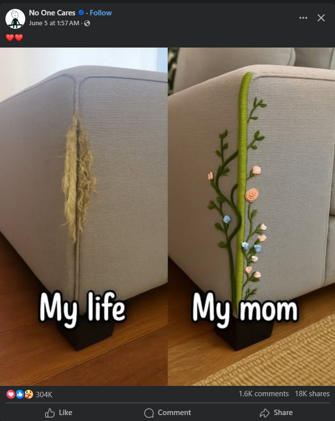

**Journal Entry Started At 6:55 PM EST on June 10th**

I don't remember every event this day, but I do remember playing video games for a bit and becoming really fatigued and exhausted. The fatigue has been getting worse and worse and this day was definitely the worst so far since my Mom passed.

I ended up laying in bed for a good 4 hours with just a dull aching pain in my chest and just muscle pains. The pain of heartache I believe and I will tell you right now, it is absolutely the worst pain when mixed with being just exhausted and overflooding memories of my Mom. My stomach has been having a lot of pains and issues as well, which is to be expected due to all the stress my body is under I believe.

I've also been worrying more and more about my Dad's health and the thought of losing him since his blood pressure is bad. I'm now so scared of losing him due to all of his health issues and broken heart syndrome is a real thing. I've always told myself that I wasn't going to lose my parents anytime soon, but now that my Mom has passed and I'm only 27 (which I guess is considered younger to lose a parent), I just feel everything is so **fragile** now. 

My Mom's online memorial was posted and it was beautifully done (I believe with the help of a great family friend, Jen, and my Dad).

I cried at certain points throughout the day. Mostly when I come downstairs and see her stuff everywhere. We are also in the process of moving out of my childhood house (which is also stressful on its own), so all of her decorations, books, etc. have been scattered around in boxes and she had **so much stuff**.

I didn't have much to eat or drink. Just one and a half bagels and maybe one - two bottles of water.

I've also been becoming easily irritated, but it's not logical and I understand that. Like for example, I feel I've been hearing the same thing over and over when I try to talk to people about my Mom. Like "you have to move on", "you need to stay strong", "she's in a better place", "she's with you", etc. And I know the people I'm talking to have good intentions and I'm by no means mad at them directly, but I feel like none of it makes me feel any better right now. The reality is right now, at the moment, I just want my Mom back. I am starting to accept that she's gone, but that doesn't change the fact I want her back. Still, just sharing her memories and story has helped at least though. I know this isn't logical thinking and I'm just emotional, I'm sure it will get better with time (or at least I really hope). I just think the reality is I feel so, so, so utterly alone through all of this. My Mom provided so much stability and just having that taken away from me has left me incredibly vulnerable.

Later on in the night, I played a really fun video game called Holdfast which has up to 75vs75 player matches and it's a very community-driven game. A lot of people like playing music and stuff over the mic (the game has proximity voice), so I was in there playing some classic 1990s and 2000s songs and just having a good time with others which really helped to be honest. For example, [here's a video](https://www.youtube.com/watch?v=VdUW4_DVMdQ) I made years ago playing the cha cha slide and 20 - 30 people played along with it. Playing this game and socializing has at least helped, even though I know it's silly to many.

Before falling asleep, I was scrolling through FaceBook and saw this post. It absolutely broke me because I think it completely resembles myself and how I view my Mom right now (even if the image was made with AI lol).

